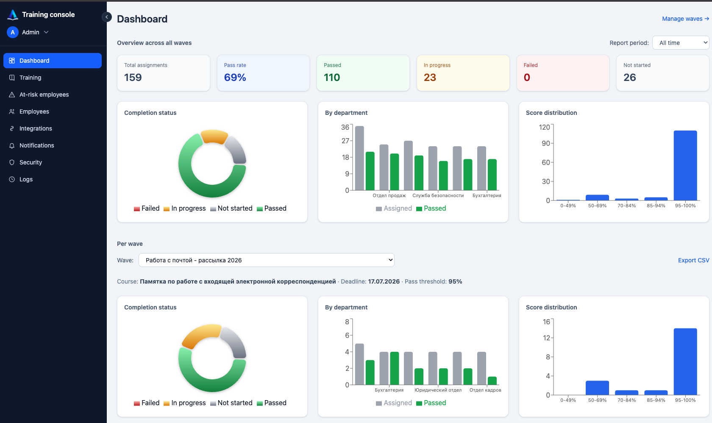
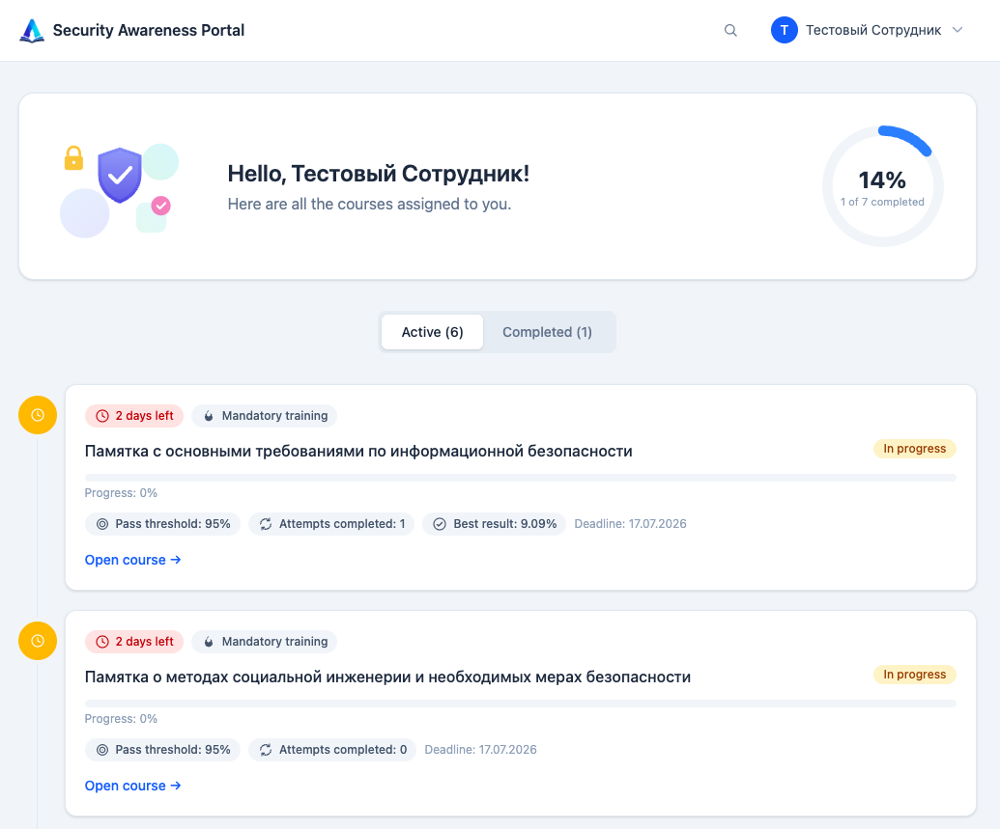

# Awareness

[English](README.md)

Открытая платформа для обучения и тестирования сотрудников по информационной безопасности.


*Дашборд с демо-данными, см. раздел «Демо-данные» ниже, чтобы получить такую же картину у себя.*


*Портал сотрудника: общий процент пройденных курсов, активные и завершенные отдельно, поиск по названию.*

## Почему это вообще существует

Я долго искал готовую бесплатную платформу для обучения сотрудников компании основам ИБ, куда можно
загрузить свой материал, назначить обучение отделам, поставить порог сдачи теста и получать на
выходе список тех, кто не прошел. Не нашел ни одного вменяемого бесплатного аналога, только дорогие
корпоративные SaaS либо самопальные Google Forms без всякого учета.

Поэтому сделал сам, для своей компании, а потом решил выложить в открытый доступ, пусть пользуется
любой, у кого та же проблема. Лицензия MIT, можно все, включая коммерческое использование. Если
платформа пригодилась, будет приятно увидеть звезду на репозитории.

## Что умеет

Курсы состоят из глав с полноценным WYSIWYG-редактором, куда можно вставлять текст, картинки,
списки и ссылки, а вопросы поддерживают один или несколько правильных вариантов ответа с
настраиваемым порогом сдачи. Волну нельзя запустить, если хотя бы в одной главе курса нет ни
одного вопроса теста - платформа не даст пройти курс простым "далее-далее-завершить" без реальной
проверки. Обучение назначается через волны: можно выбрать конкретных сотрудников, целый отдел или
всех сразу, задать дедлайн и лимит попыток, а запустить кампанию можно одним кликом прямо со
страницы курса.

Дашборд для ИБ-менеджера показывает, кто сдал, кто не сдал и кто еще не начал, с разбивкой по
отделам, распределением баллов, отдельным списком проблемных сотрудников (не сдавших вообще или
сдавших не с первого раза) и экспортом результатов в CSV.

Вход можно настроить через Active Directory или LDAP прямо в консоли администратора, без правки
конфигов и перезапуска контейнеров. Интерфейс двуязычный, русский и английский переключаются на
лету.

Роли трехуровневые: сотрудник просто проходит назначенное обучение, менеджер обучения может вести
курсы и запускать волны без доступа к сотрудникам и интеграциям, а администратор видит все и умеет
назначать роли остальным прямо в консоли - никакого доступа к базе или Django Admin для этого не
нужно.

Для интеграции с внешними сервисами предусмотрены API-токены. Например, ваш скрипт аудита паролей
сможет через API назначать сотрудникам обучение, при этом токен привязывается к конкретным курсам
еще при создании, так что утечка не позволит назначить произвольное обучение (подробности в
[docs/integrations-api.ru.md](docs/integrations-api.ru.md)).

Уведомления поддерживают Email по SMTP, Telegram, Slack и Microsoft Teams: сотрудник получает
письмо при назначении обучения и напоминание за три дня до дедлайна, а администраторам приходит
дайджест по просроченным волнам. Все секреты каналов хранятся в базе зашифрованными.

Все сервисы, включая планировщик напоминаний, поднимаются одной командой через Docker Compose.

## Стек

Backend написан на Django, Django REST Framework и PostgreSQL, frontend на React, Vite, TypeScript
и Tailwind CSS. Административная консоль - отдельное React-приложение, Django Admin используется
только для точечных случаев. Деплой через Docker Compose: nginx, gunicorn и postgres.

## Быстрый старт (Docker)

```bash
cp .env.example .env
```

В `.env` обязательно задайте `DJANGO_SECRET_KEY` (любая длинная случайная строка) и
`FIELD_ENCRYPTION_KEY`, который шифрует пароли и токены в разделе "Уведомления" (SMTP, Telegram,
Slack, Teams). Без него портал работает, но сохранить секрет уведомлений не получится: вместо
тихой поломки будет явная ошибка. Сгенерировать ключ можно так:

```bash
python3 -c "from cryptography.fernet import Fernet; print(Fernet.generate_key().decode())"
```

Если разворачиваете не на `localhost` (реальный IP сервера или домен), также поправьте в `.env`
`DJANGO_ALLOWED_HOSTS`, `CORS_ALLOWED_ORIGINS` и `CSRF_TRUSTED_ORIGINS` под тот адрес, с которого
реально будете открывать портал - по умолчанию там только `localhost`/`127.0.0.1`. Если пропустить
этот шаг, сам фронтенд откроется нормально (это статика, ее отдает nginx), а любой запрос к API,
начиная со входа, будет падать с родовой Django-страницей "Bad Request (400)".

Дальше:

```bash
docker compose up --build -d
docker compose exec backend python manage.py createsuperuser

# Стартовые курсы (идемпотентны, можно гонять повторно):
docker compose exec backend python manage.py seed_ib_course           # Инструктаж по ИБ 2025
docker compose exec backend python manage.py seed_mailing_courses     # памятки из рассылок УИБ
docker compose exec backend python manage.py seed_ai_usage_courses    # безопасное использование ИИ
```

Портал доступен на http://localhost:8090/, консоль администратора на http://localhost:8090/console/,
Django Admin на http://localhost:8090/admin/.

## Демо-данные

Чтобы дашборд и списки выглядели так же, как на скриншоте выше, а не пустыми, без необходимости
заводить и прогонять через тест реальных сотрудников компании:

```bash
docker compose exec -e ALLOW_DEMO_SEED=true backend python manage.py seed_demo_data
```

Команда создаст около шести отделов, около двадцати четырех демо-сотрудников и результаты обучения
с разными исходами: сдал с первого раза, сдал со второй попытки, не сдал, не начал. Это не для
продакшена: у всех демо-сотрудников один и тот же известный пароль (`Demo12345!`, печатается в
выводе команды), а сама команда записывает фиктивных сотрудников в реальные активные волны, поэтому
`ALLOW_DEMO_SEED=true` обязателен, без него команда откажется запускаться, чтобы не испортить
статистику на боевой базе. Команда идемпотентна для отделов и сотрудников, но при повторном запуске
добавляет новые попытки тестов.

## Ручная установка (без Docker)

`python-ldap` (нужен для входа через Active Directory/LDAP) собирает C-расширение против
заголовков OpenLDAP - в Docker-образе они уже стоят, а при ручной установке их нужно поставить
заранее, иначе `pip install` упадет с `fatal error: lber.h: No such file or directory`:

```bash
# Debian/Ubuntu
sudo apt install libldap2-dev libsasl2-dev python3-dev libssl-dev
# RHEL/CentOS
sudo dnf install openldap-devel cyrus-sasl-devel python3-devel gcc
# macOS
brew install openldap
export LDFLAGS="-L/usr/local/opt/openldap/lib"
export CPPFLAGS="-I/usr/local/opt/openldap/include"
```

Backend:
```bash
cd backend
python3.12 -m venv .venv && source .venv/bin/activate
pip install -r requirements.txt
# нужен локальный Postgres, см. переменные POSTGRES_* в config/settings.py
python manage.py migrate
python manage.py seed_ib_course
python manage.py seed_mailing_courses
python manage.py seed_ai_usage_courses
python manage.py runserver 127.0.0.1:8010
```

Frontend:
```bash
cd frontend
npm install
npm run dev   # http://localhost:5173, /api проксируется на backend :8010
```

Запускайте именно `npm run dev` (а не голый `npx vite`) после того как `npm install` полностью
отработал - `npx vite` тянет изолированную самостоятельную копию Vite, которая не видит
собственные плагины проекта (`@vitejs/plugin-react`, `@tailwindcss/vite`), и падает с ошибками
вида `Could not resolve 'vite'`. Если запускаете внутри виртуалки и нужно достучаться до
дев-сервера с браузера хост-машины, добавьте `-- --host 0.0.0.0` к команде - по умолчанию Vite
слушает только `localhost` внутри виртуалки.

Для боевого развертывания без Docker собирайте фронтенд через `npm run build` и раздавайте своим
nginx вместо `npm run dev`. `frontend/nginx.conf` - готовый конфиг под это, но он рассчитан на сеть
Docker Compose - прежде чем его переиспользовать, замените каждый
`proxy_pass http://backend:8000/...;` на реальный хост и порт, где слушает ваш Django-процесс
(gunicorn или `manage.py runserver`) - имя `backend` резолвится только внутри Compose.

## Обновление

```bash
git pull
docker compose up -d --build
```

Для обычного обновления через Docker этого достаточно - сотрудники, курсы и результаты тестов
живут в именованных Docker-томах, которые пересборка образов не трогает, а контейнер `backend` сам
накатывает накопившиеся миграции базы при старте. Единственное, что нельзя запускать на боевом
окружении - `docker compose down -v`: флаг `-v` безвозвратно удаляет эти тома вместе с базой. Если
ставили вручную (см. ниже) - это просто `git pull`, `pip install -r requirements.txt`,
`python manage.py migrate` и `npm install`. Полные шаги для обоих вариантов, а также как сделать
бэкап базы перед обновлением, откатиться назад и разворачиваться с конкретного тега версии вместо
плавающего `main` - в [docs/upgrading.ru.md](docs/upgrading.ru.md). Перед обновлением сверьтесь с
[CHANGELOG.ru.md](CHANGELOG.ru.md) на предмет версии, на которую обновляетесь.

## Документация

Формат API для внешних сервисов, включая аутентификацию, эндпоинты и лимиты, описан в
[docs/integrations-api.ru.md](docs/integrations-api.ru.md). Пошаговый гайд администратора
(развертывание, настройка LDAP и уведомлений, создание курса, запуск обучения, работа с
проблемными сотрудниками) находится в [docs/admin-guide.ru.md](docs/admin-guide.ru.md). Список
изменений по версиям - в [CHANGELOG.ru.md](CHANGELOG.ru.md).

## Структура проекта

Backend разбит по Django-приложениям. `accounts` отвечает за сотрудников, отделы и аутентификацию
(сессии, CSRF, LDAP/AD), `courses` за курсы, главы, вопросы и варианты ответов, `waves` за волны
обучения, назначения и дашборд с экспортом для ИБ-менеджера, `quizzes` за попытки прохождения
теста, которые становятся неизменяемыми после отправки и служат аудиторским следом, `integrations`
за API-токены для внешних сервисов, `notifications` за уведомления в Email, Telegram, Slack и
Teams. `frontend` - единое SPA-приложение, которое обслуживает и пользовательский портал, и
консоль администратора.

## Поддержать проект

Если платформа сэкономила вам время и деньги на корпоративном SaaS, будет приятно увидеть звезду
на репозитории, это уже помогает другим найти проект.

## Лицензия

[MIT](LICENSE): используйте как угодно, включая коммерческое использование, просто сохраните
указание авторства.
